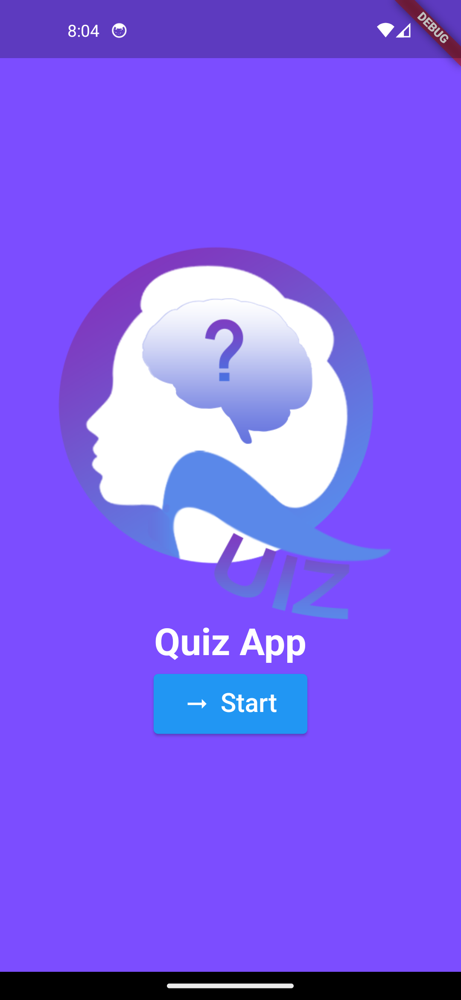
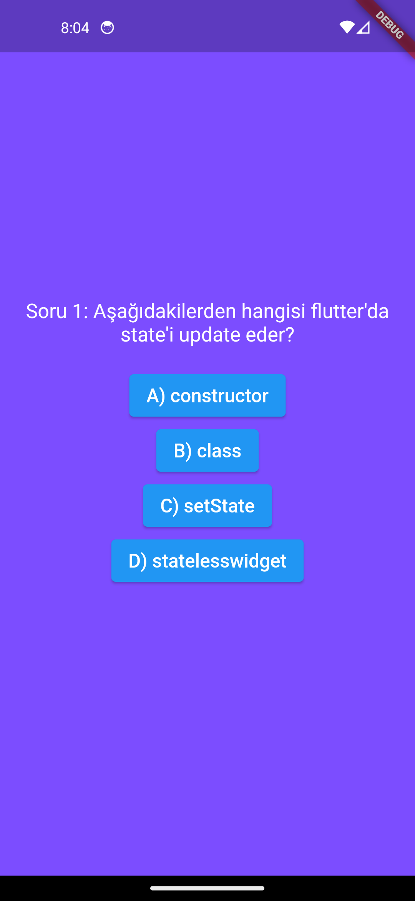
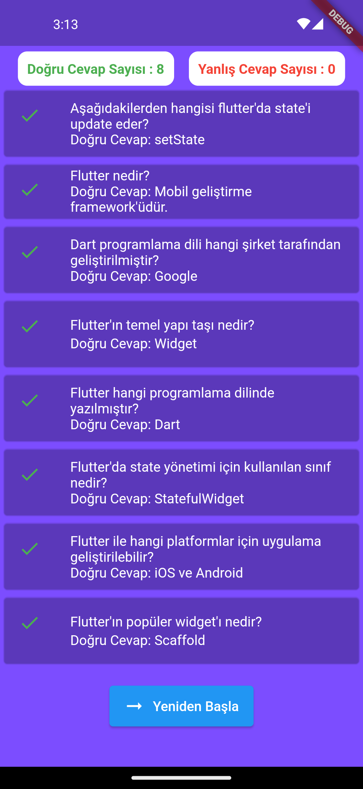
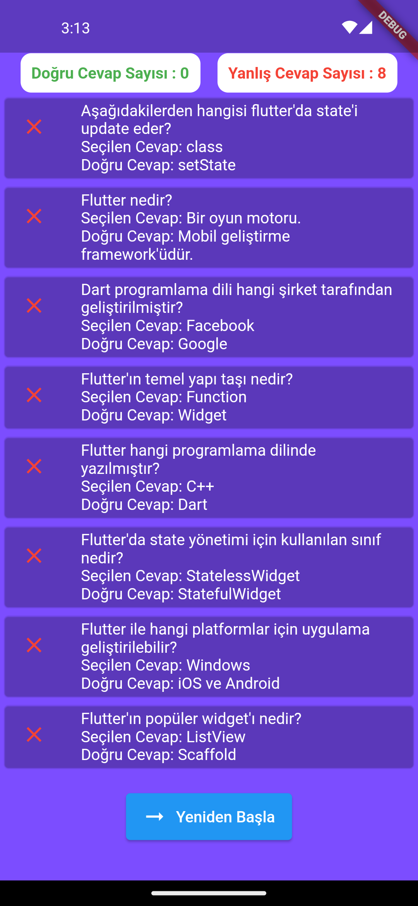

# quiz_app

Flutter ile geliştirilmiş, kullanıcının sınav sorularını çözmesini ve sonuçları ekranda görmesini sağlayan
Quiz app Mobil uygulamasıdır.

## Proje içeriği

- data modeli, sınav sorularını ve soruların doğru cevaplarını tutan uygulamanın veri modeli.
- question screen, kullancının sınav sorularını görmesini sağlar.
- result screen, kullanıcının cevapladığı soruların yanlış ve doğru sayılarını hesaplar ve kullanıcıya gösterir.

